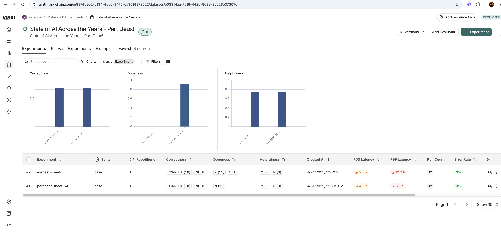

<p align = "center" draggable=”false” >
</p>

## <h1 align="center" id="heading">Session 7: Synthetic Data Generation and LangSmith</h1>

| 🤓 Pre-work | 📰 Session Sheet | ⏺️ Recording     | 🖼️ Slides        | 👨‍💻 Repo         | 📝 Homework      | 📁 Feedback       |
|:-----------------|:-----------------|:-----------------|:-----------------|:-----------------|:-----------------|:-----------------|
| [Session 7: Pre-Work](https://www.notion.so/Session-7-Synthetic-Data-Generation-for-Evaluation-1c8cd547af3d81999da6cbd18ae4b6a9?pvs=4#1c8cd547af3d81edb0f8ca8017d1cfdb)| [Session 7: Synthetic Data Generation for Evaluation](https://www.notion.so/Session-7-Synthetic-Data-Generation-for-Evaluation-1c8cd547af3d81999da6cbd18ae4b6a9) | [Recording](https://us02web.zoom.us/rec/share/fSb3DEXkbvGFQgQwwXY9Htm7CzLKXqTuOscraGRRFaj7bC7XIODwhgP2VgXpx1Uu.dKkuAcnlOrlQ7Bcq) (M9g55ye#) | [Session 7: Synthetic Data Generation for Evaluation](https://www.canva.com/design/DAGjaZbyELk/2hj3-ZHrH6x4kjz1Y3kAYw/edit?utm_content=DAGjaZbyELk&utm_campaign=designshare&utm_medium=link2&utm_source=sharebutton)| You Are Here!| [Session 7: Synthetic Data Generation for Evaluation](https://forms.gle/DVmFHjkkgFpAKNoEA)| [AIE6 Feedback 4/22](https://forms.gle/Z1DahTCVsNPp6SrU6)

In today's assignment, we'll be creating Synthetic Data, and using it to benchmark (and improve) a LCEL RAG Chain.

#### ❓ Question #1:

What are the three types of query synthesizers doing? Describe each one in simple terms.
#### 📍 Answer #1

<div style="color: blue; font-family: Arial, sans-serif;">

**SingleHopSpecificQuerySynthesizer:** Creates direct questions that can be answered from a single piece of information in the docs. These are focused questions that typically ask about specific facts, definitions, or details contained in one location in the text

**Examples:**
- "What is midjourney?"
- "Why is 2023 considered a breakthrough year for AI?"
- "What is the significance of Abu Dhabi in the context of AI?"

**MultiHopAbstractQuerySynthesizer:** Generates broader, conceptual questions that require synthesizing information from multiple parts of the loaded docs. These questions are more theoretical and ask about relationships, impacts, or high-level concepts that span across different sections of content.

**Examples:**
- "How does the environmental impact of AI training affect the future development of models?"
- "How can prompt engineering influence the effectiveness of language models?"
- "How large language models (LLMs) are related to future AI developments?"

**MultiHopSpecificQuerySynthesizer:** Creates complex questions that require connecting specific details from different parts of the loaded docs. These combine the specificity of single-hop queries with the multi-source nature of abstract queries, asking about detailed relationships between specific entities or concepts.

**Examples:**
- "How does Llama 3.1 relate to the development of open-source AI models?"
- "What is Claude's role in integrating AI features across different platforms?"
- "How do LLMs impact AI development and how are they so advanced?"

Each synthesizer is given a weight in the distribution (0.5, 0.25, 0.25) to control how many of each type appear in the generated test dataset, creating a balanced mix of question complexity to better evaluate RAG systems

</div>

#### 🏗️ Activity #2:

Highlight what each evaluator is evaluating.

- `qa_evaluator`:
- `labeled_helpfulness_evaluator`:
- `dope_or_nope_evaluator`:
#### 💡 Solution Activity #2:

<div style="color: blue; font-family:sans-serif;">
The three evaluators are assessing different aspects of LLM responses:
<ul>
<li> <b> qa_evaluator:</b> Evaluates the correctness of answers by comparing them against reference answers. This built-in evaluator measures factual accuracy and completeness of responses to questions.</li>
<li> <b> labeled_helpfulness_evaluator:</b> Assesses how helpful the response is to the user, considering the reference answer as ground truth. The custom prepare_data function maps the model's output, the expected answer, and the original question for proper evaluation.</li>
<li> <b> dope_or_nope_evaluator:</b> A subjective evaluator that measures the "coolness" or stylistic appeal of responses - whether they're engaging, interesting, or appealing in tone. This is a less standard metric focused on user experience rather than factual correctness.
</li>
</ul>
Each evaluator uses the same LLM (eval_llm) to perform these assessments, leveraging it as a judge of the generated content.
</div>

#### ❓Question #2:

Why would modifying our chunk size modify the performance of our application?

#### 📍 Answer #2:
<div style="color: blue; font-family:sans-serif;">

Increasing the chunk size from 500 to 1000 characters likely improves performance by providing more complete context to the retrieval system, which helps the model generate more accurate and comprehensive responses, especially for complex or nuanced questions. Smaller chunks provide more focused and precise retrieval that can target specific information, but might miss broader context
</div>

#### ❓Question #3:

Why would modifying our embedding model modify the performance of our application?

#### 📍 Answer #3:

<div style="color: blue; font-family:sans-serif;">

Modifying the embedding model from "text-embedding-3-small" to "text-embedding-3-large" will impact RAG performancein several ways:
<ul>
<li> Better Semantic Understanding: because the large model offers higher dimension embeddings with more nuanced semantics.</li>
<li> Better Retrieval Accuracy: It allows for more precise similarity calculations between queries and doc chunks. Will also reduce false positives </li>
<li> Better handling of Contextual Complexity: It can provide more robust connection between related technical terms and improved ability to match context in different ways.</li>
<li> Better Contextual Awareness: Beter performance with abstract or complex queries and better handling of ambiguous terms based on surrounding context.</li>
<li> Better Language Nuance : Larger embedding models can provide better handling of domain specific language and are more effective with indirect or inferential queries.
</ul>

</div>

#### 🏗️ Activity #3:

Provide a screenshot of the difference between the two chains, and explain why you believe certain metrics changed in certain ways.

#### 💡 Solution #3

The dope_rag_prompt which we added to the dopeness LCEL chain, has resulted in the dopeness factor of the answers evaluating better.



- 🤝 BREAKOUT ROOM #1
  1. Use RAGAS to Generate Synthetic Data

- 🤝 BREAKOUT ROOM #2
  1. Load them into a LangSmith Dataset
  2. Evaluate our RAG chain against the synthetic test data
  3. Make changes to our pipeline
  4. Evaluate the modified pipeline

## Ship 🚢

The completed notebook!

#### 🏗️ BONUS ACTIVITY (OPTIONAL):

Reproduce the RAGAS Synthetic Data Generation Steps - but utilize a LangGraph Agent Graph, instead of the Knowledge Graph approach.

This generation should leverage the [Evol Instruct](https://arxiv.org/pdf/2304.12244) method to generate synthetic data.

Your final state (output) should contain (at least, not limited to):

1. `List(dict)`: Evolved Questions, their IDs, and their Evolution Type.
2. `List(dict)`: Question IDs, and Answer to the referenced Evolved Question.
3. `List(dict)`: Question IDs, and the relevant Context(s) to the Evolved Question.

The Graph should handle:

1. Simple Evolution.
2. Multi-Context Evolution.
3. Reasoning Evolution.

It should take, as input, a list of LangChain Documents.

### Deliverables

- A short Loom of the notebook, and a 1min. walkthrough of the application in full

## Share 🚀

Make a social media post about your final application!

### Deliverables

- Make a post on any social media platform about what you built!

Here's a template to get you started:

```
🚀 Exciting News! 🚀

I am thrilled to announce that I have just built and shipped Synthetic Data Generation, benchmarking, and iteration with RAGAS & LangChain! 🎉🤖

🔍 Three Key Takeaways:
1️⃣ 
2️⃣ 
3️⃣ 

Let's continue pushing the boundaries of what's possible in the world of AI and question-answering. Here's to many more innovations! 🚀
Shout out to @AIMakerspace !

#LangChain #QuestionAnswering #RetrievalAugmented #Innovation #AI #TechMilestone

Feel free to reach out if you're curious or would like to collaborate on similar projects! 🤝🔥
```
