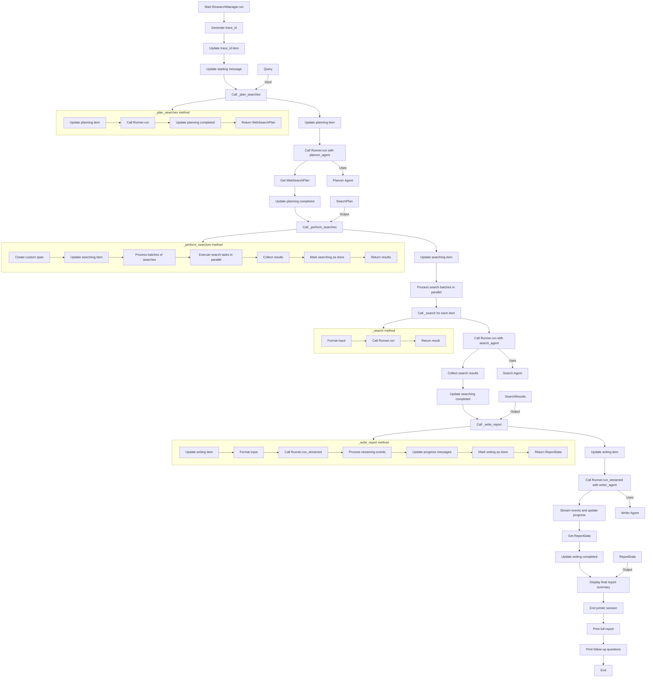

```mermaid
flowchart TD
    A[Start ResearchManager.run] --> B[Generate trace_id]
    B --> C[Update trace_id item]
    C --> D[Update starting message]
    
    %% Plan Searches Flow
    D --> E[Call _plan_searches]
    E --> F[Update planning item]
    F --> G[Call Runner.run with planner_agent]
    G --> H[Get WebSearchPlan]
    H --> I[Update planning completed]
    
    %% Perform Searches Flow
    I --> J[Call _perform_searches]
    J --> K[Update searching item]
    K --> L[Process search batches in parallel]
    L --> M[Call _search for each item]
    M --> N[Call Runner.run with search_agent]
    N --> O[Collect search results]
    O --> P[Update searching completed]
    
    %% Write Report Flow
    P --> Q[Call _write_report]
    Q --> R[Update writing item]
    R --> S[Call Runner.run_streamed with writer_agent]
    S --> T[Stream events and update progress]
    T --> U[Get ReportData]
    U --> V[Update writing completed]
    
    %% Output Results
    V --> W[Display final report summary]
    W --> X[End printer session]
    X --> Y[Print full report]
    Y --> Z[Print follow-up questions]
    Z --> END[End]
    
    %% Subgraph for _search method
    subgraph search_method[_search method]
        M1[Format input] --> M2[Call Runner.run]
        M2 --> M3[Return result]
    end
    
    M --> search_method
    
    %% Subgraph for _plan_searches method
    subgraph plan_searches[_plan_searches method]
        E1[Update planning item] --> E2[Call Runner.run]
        E2 --> E3[Update planning completed]
        E3 --> E4[Return WebSearchPlan]
    end
    
    E --> plan_searches
    
    %% Subgraph for _perform_searches method
    subgraph perform_searches[_perform_searches method]
        J1[Create custom span] --> J2[Update searching item]
        J2 --> J3[Process batches of searches]
        J3 --> J4[Execute search tasks in parallel]
        J4 --> J5[Collect results]
        J5 --> J6[Mark searching as done]
        J6 --> J7[Return results]
    end
    
    J --> perform_searches
    
    %% Subgraph for _write_report method
    subgraph write_report[_write_report method]
        Q1[Update writing item] --> Q2[Format input]
        Q2 --> Q3[Call Runner.run_streamed]
        Q3 --> Q4[Process streaming events]
        Q4 --> Q5[Update progress messages]
        Q5 --> Q6[Mark writing as done]
        Q6 --> Q7[Return ReportData]
    end
    
    Q --> write_report
    
    %% Agent Interactions
    G -- Uses --> Planner[Planner Agent]
    N -- Uses --> Search[Search Agent]
    S -- Uses --> Writer[Writer Agent]
    
    %% Data Flow
    Query -- Input --> E
    SearchPlan -- Output --> J
    SearchResults -- Output --> Q
    ReportData -- Output --> W
``` 