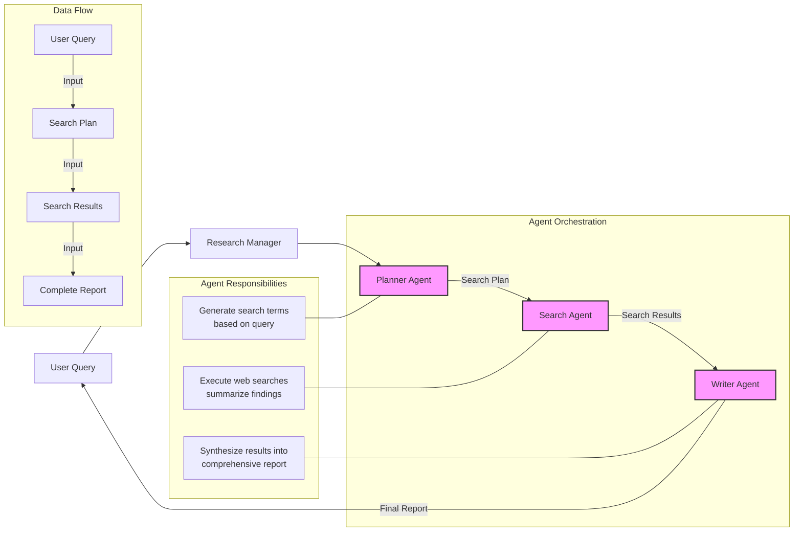

```mermaid
flowchart LR
    User[User Query] --> RM[Research Manager]
    RM --> PA[Planner Agent]
    PA -- Search Plan --> SA[Search Agent]
    SA -- Search Results --> WA[Writer Agent]
    WA -- Final Report --> User
    
    subgraph Agent_Flow[Agent Orchestration]
        PA
        SA
        WA
    end
    
    subgraph Data_Flow[Data Flow]
        Query[User Query] --> |Input| Plan[Search Plan]
        Plan --> |Input| Results[Search Results] 
        Results --> |Input| Report[Complete Report]
    end
    
    subgraph Agent_Tasks[Agent Responsibilities]
        Planning[Generate search terms\nbased on query] --- PA
        Searching[Execute web searches\nsummarize findings] --- SA
        Writing[Synthesize results into\ncomprehensive report] --- WA
    end
    
    class PA,SA,WA agent;
    classDef agent fill:#f9f,stroke:#333,stroke-width:2px;
``` 